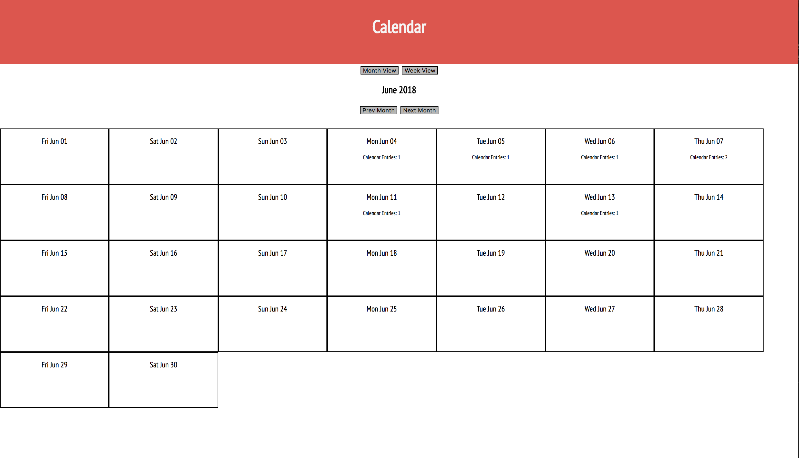

This project was bootstrapped with [Create React App]().

To run this project locally navigate to the main folder and use `yarn install` then `yarn start` in the terminal command line.

## Calendar

When the page initially loads you will see the current month and year listed with the monthly calendar shown below. You will also be able to see which (if any) of the dates have calendar entries stored, and how many entries you have that day. From this screen you have a couple of options...

-You can navigate to previous or future months to view those monthly calendars using the 'Prev Month' and 'Next Month' buttons located below the month and year.

-You can switch to view more detailed weekly calendars by clicking on the 'Week View' button above the current month and year. This will show you to the first week of whichever month you were viewing. You will now be able to see your calendar entries for each day of that week, as well as edit/remove/add entries. You also have the option to navigate to future or previous weeks using the 'Prev Week' and 'Next Week' buttons located above the weekly calendar. To return to the monthly calendar view simply click the 'Month View' button above the month and year.

-You can double click on a specific date to take you to the week view of that date and have all the functionality that you would from clicking on the 'Week View' button.

###Month View

###Week View

### Built Utilizing:
Create React App - <https://github.com/facebookincubator/create-react-app/> \
React - <https://reactjs.org/> \
Moment.js - <https://momentjs.com/> \
Underscore.js - <https://underscorejs.org/> \
Google Fonts - <https://fonts.google.com/> \